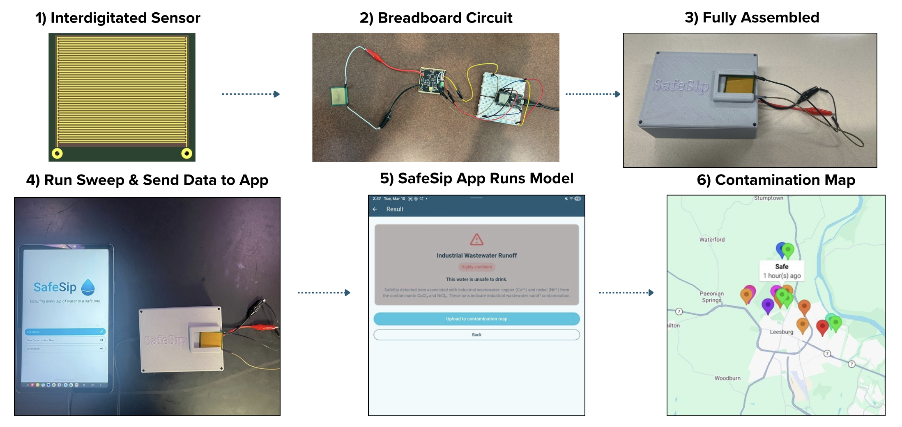

# SafeSip 💧
 
**A $40 handheld device that detects invisible ionic contaminants in drinking water in under 5 seconds utilizing electrochemical impedance spectroscopy and on-device machine learning.**
 
[Read the paper](./SafeSip_Paper.pdf)
 
## How it works
 
Different dissolved ions respond uniquely to an oscillating electric field depending on their size, charge density, and mobility. Sweeping across frequencies produces a distinct electrochemical "fingerprint" for each contaminant, which a machine learning model is then trained to classify.
 
**Hardware:** a custom interdigitated PCB sensor feeds into an AD5933 impedance analyzer driven by an ESP32, all consolidated into a single handheld enclosure.
 
**Software:** the sensor runs a frequency sweep and streams data to the Flutter app, which runs baseline subtraction and on-device classification, then optionally uploads the result to a crowdsourced contamination map.

 
## Results
 
| Metric | Result |
|---|---|
| Classification accuracy | **96.2%** (stratified 5-fold cross-validation) |
| Macro F1 score | 0.9616 |
| Cross-matrix invariance (Pearson r) | 0.9904 (real) / 0.9821 (imaginary) |
| Contaminants + mixtures tested | 6 ionic contaminants, 3 binary mixtures |
| Inference time | < 4 seconds, on-device |
| Hardware cost | < $40 per unit |
 
Full methodology, dataset details, and discussion of limitations are in [`SafeSip_Paper.pdf`](./SafeSip_Paper.pdf).
 
 
## Repo structure
 
| Folder | What's in it |
|---|---|
| [`sensor_sweep/`](./sensor_sweep) | ESP32 firmware that drives the AD5933 and runs the frequency sweep |
| [`model/`](./model) | Data preprocessing, Delta Method implementation, and Random Forest training/evaluation pipeline |
| [`mobile/`](./mobile) | Flutter app: USB connection to hardware, on-device inference, GPS-tagged contamination map |

  
## Authors
 
Built by **Yash Sreepathi** and **Saatvik Sunilraj**.
 
